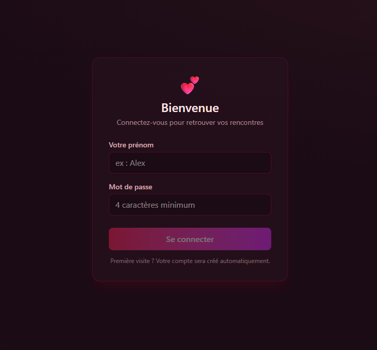
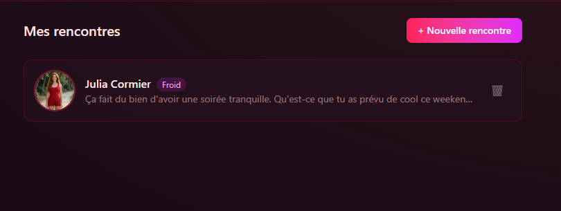
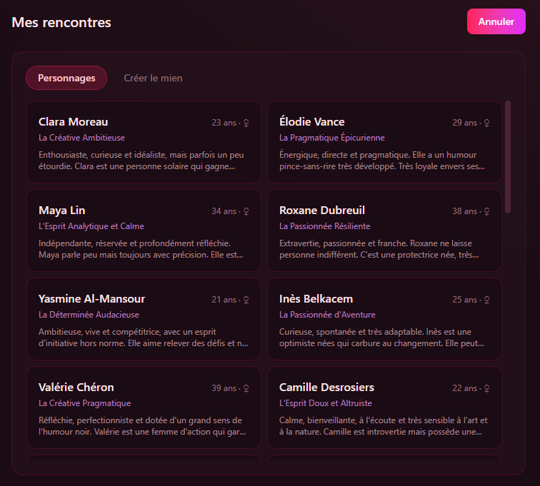
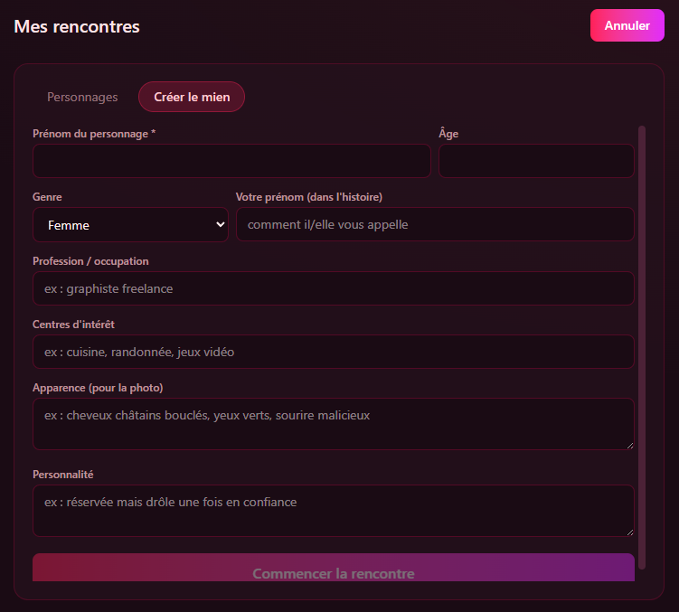
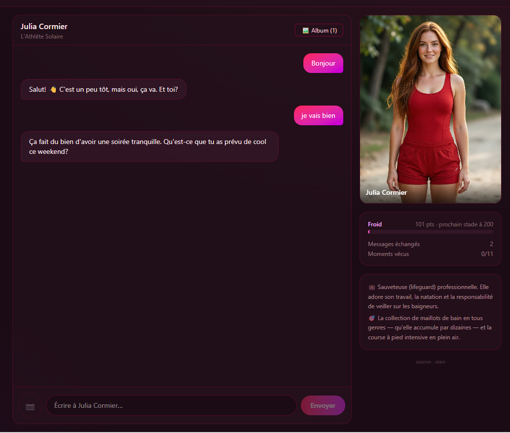
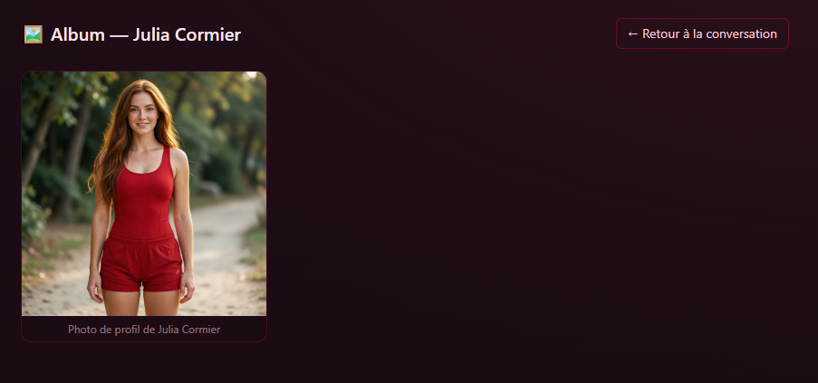

# 💕 Ami(e) IA — Rencontres virtuelles

> **⚠️ Contenu pour adultes averti (18 ans +)** — Cette application simule des
> relations virtuelles et peut générer des contenus sensibles à mesure que la
> relation évolue. Une déclaration de majorité est demandée à la connexion.

Application de **simulation de rencontre** avec des personnages IA : vous
discutez avec un personnage, vos mots font évoluer la relation, et vous
découvrez peu à peu son histoire — jusqu'à décrocher des photos et atteindre
une relation « proche ».

Le tout tourne **en local sur votre machine** (aucune donnée envoyée sur
Internet) : chat sous llama.cpp, images sous ComfyUI, mémoire vectorielle
sous un serveur d'embeddings.

---

## 🎯 Le but du jeu

Chaque rencontre démarre au stade **« froid »** (score 100/1000) :

```
rejet → froid → réservé → neutre → chaleureux → proche
```

- **Discutez** avec le personnage : chaque message est analysé par un moteur
  déterministe qui ajuste le score relationnel (+/- points selon la
  gentillesse, l'intérêt porté, les impairs…).
- **Faites monter la relation** : franchir un stade débloque de nouveaux
  scénarios narratifs et le droit de demander des 📷 **photos**
  (refusées avant le stade « neutre »).
- **Vivez les scénarios** : le serveur injecte périodiquement des événements
  scriptés (rendez-vous, surprises, crises…) selon votre stade — au total
  **275 scénarios** répartis sur les personnages.
- **Entretenez le lien** : après 3 jours sans nouvelles, la relation se
  dégrade (-10 pts/jour). Les absents sont punis !
- **Objectif** : atteindre le stade « proche »… et y rester.

## ✨ Fonctionnalités

| | |
|---|---|
| 💬 **Chat en temps réel** | WebSocket, réponses streaming du personnage, indicateur de saisie |
| 🎭 **25 personnages** | Personnages prédéfinis (apparence, caractère, histoire) ou création personnalisée |
| ❤️ **Relation chiffrée** | Score /1000 + stades affichés, évolution visible après chaque message |
| 📸 **Album photo** | Portrait généré automatiquement à la rencontre ; photos qui reflètent la scène en cours (le « directeur photo » analyse les derniers échanges) — cadrage **selfie** par défaut (téléphone tenu dans sa main), sauf demande contraire |
| 💌 **Messages proactifs** | Après 24 h de silence, le personnage vous écrit (1 message/jour max) ; sans réponse avant le suivant : **-50 points** de relation — badge rouge avec compteur sur son encadré dans *Mes rencontres*. Le ton monte avec le silence : ennui → inquiétude → tristesse → frustration → colère blessée |
| 🤳 **Initiative photo** | Le personnage peut envoyer de lui-même des photos pertinentes (stade Neutre+) |
| 🔒 **Garde-fous techniques** | Tenue des photos contrainte par stade côté serveur — le LLM ne peut pas contourner |
| 🧠 **Mémoire** | Extraction périodique de souvenirs + rappel sémantique (le personnage se souvient de vous) |
| 👤 **Comptes locaux** | Inscription/connexion avec tokens Bearer — chaque utilisateur voit uniquement ses sessions |
| 🖼 **Visionneuse** | Album consultable plein écran (clavier ←/→, Échap) |

## 🖼 Captures d'écran

| | |
|---|---|
|  |  |
|  |  |
|  |  |

## ⚙️ Comment ça marche

La particularité d'Ami(e) IA : la mécanique de jeu est **100 % déterministe
et côté serveur**. Le LLM n'incarne QUE le personnage — il ne calcule ni
score, ni stades, ni scénarios, ni photos. Impossible de le convaincre de
« tricher ».

```
client/          React 18 + TS + Vite 6 + Tailwind v4 (build → server/static)
server/
  main.py        FastAPI : REST + WebSocket chat + statique + messages proactifs
  auth.py        Comptes PBKDF2 + tokens Bearer HMAC
  config.py      Chargement YAML (config/config.yaml)
  relation/      Score, stades, scénarios, presets, souvenirs (déterministe)
  llm/           Client llama.cpp (streaming SSE) + prompt builder
  image/         ComfyUI : portrait auto + photos gated par stade
  prompts/       Persona du compagnon (SystemPrompt_Compagnon.md)
data/
  character_presets/   25 personnages + 275 scénarios (portés de l'original)
server/data/     Runtime : sessions, historiques, photos, utilisateurs.json
config/          config.yaml (local, gitignoré) — voir config.example.yaml
```

### Mécanique détaillée

- **Score relationnel** (100 au départ) ajusté après chaque message par un
  moteur mots-clés/patterns ; stades : rejet → froid → réservé → neutre →
  chaleureux → proche.
- **Scénarios** (lettres A-K par personnage) injectés côté serveur selon les
  gates de stade ; consommation détectée par similarité cosinus entre le
  scénario et la réponse (embeddings), forcée après 3 tours.
- **Décroissance temporelle** après 3 jours d'absence (-10 pts/jour,
  plafond -150).
- **Souvenirs** : extraction périodique (tous les 10 tours) + rappel
  sémantique top-k.
- **Photos** : portrait généré automatiquement à la création de session ;
  demandes via bouton 📷 (refusées avant le stade « neutre »). Le prompt est
  construit par un « directeur photo » : un appel LLM court résume les
  derniers échanges en fragments visuels (lieu, pose, regard), sanitisés
  selon le stade. Cadrage par défaut : **selfie** (téléphone tenu dans sa
  main, bras tendu), sauf avis contraire exprimé dans la conversation.
- **Messages proactifs** : après 24 h sans échange, le personnage écrit le
  premier (1 message/jour max, jamais au stade « rejet »). Si l'utilisateur
  n'a pas répondu au message précédent avant le suivant : -50 points. Le
  message porte sur le manque de réponse, avec une gradation émotionnelle
  (ennui → inquiétude → tristesse → frustration → colère blessée). Un badge
  rouge avec le nombre de messages sans réponse s'affiche sur l'encadré du
  personnage dans « Mes rencontres » ; il disparaît dès que vous répondez.
- **Initiative photo** : au stade Neutre+, le personnage peut envoyer de
  lui-même une photo (probabilité par tour, plus élevée avec un message
  spontané) — même pipeline directeur photo + garde-fous de tenue.
- **VRAM** : le modèle de chat est déchargé quand aucun tour n'est actif,
  libérant la place pour ComfyUI.
- **18+** : mention affichée sur l'écran de connexion + case de déclaration
  de majorité obligatoire.

## 🚀 Installation & démarrage (Docker, recommandé)

Prérequis :
- **Docker Desktop** avec support GPU NVIDIA (recommandé ; sans GPU, voir la
  note dans `docker-compose.yml` pour passer en CPU) ;
- les **modèles GGUF** téléchargés (voir « 🧠 Modèles » ci-dessous) ;
- *(optionnel)* **ComfyUI** sur l'hôte (port 8188) pour les images.

```powershell
git clone https://github.com/alainlizotte/amie-ia.git
cd "amie-ia"
copy config.example.yaml config\config.yaml
.\scripts\demarrer-serveur.bat     # docker compose up -d --build
# → http://localhost:8124
.\scripts\arreter-serveur.bat      # arrêt
```

Le docker-compose lance **tout le nécessaire** : le serveur web Ami(e) IA,
llama.cpp (chat, GPU) et le serveur d'embeddings (mémoire sémantique, CPU).
Aucune autre application n'est requise.

## 🛠 Développement local

```powershell
python -m venv .venv
.venv\Scripts\pip install -r requirements.txt
.venv\Scripts\python -m uvicorn server.main:app --port 8000

cd client
npm install
npm run dev          # http://localhost:5174 (proxy /api /ws /data → 8000)
npm run build        # → ../server/static
```

En local, adapter `config/config.yaml` : `llm.base_url: http://127.0.0.1:8080/v1`
et `memory.embedding_base_url: http://127.0.0.1:8081/v1`.

## Configuration

Copier `config.example.yaml` vers `config/config.yaml` puis ajuster :
backend LLM (`llamacpp`/`ollama`), modèle, paramètres relationnels
(cooldown des scénarios, décroissance, seuils de similarité…).

## 🧠 Modèles

Deux modèles GGUF sont requis (non versionnés : trop volumineux). Téléchargez-les
sur Hugging Face et placez-les aux emplacements indiqués :

| Rôle | Fichier | Emplacement | Taille |
|---|---|---|---|
| Chat | `gemma-4-E4B-it-qat-q4_0-unquantized-heretic-Q4_0.gguf` | `models/` | ~4,8 Go |
| Embeddings (mémoire) | `embeddinggemma-300M-qat-Q4_0.gguf` | `models-embed/` | ~265 Mo |

Le nom déclaré dans `config/config.yaml` (`llm.model`) doit correspondre
exactement au nom du fichier de chat sans l'extension `.gguf` — c'est déjà le
cas dans `config.example.yaml`. Pour utiliser un autre modèle de chat :
renommer le fichier ou ajuster `llm.model`.

## API

| Méthode | Route | Description |
|---|---|---|
| GET | `/api/health` | État des backends |
| POST | `/api/auth/inscription` | Création de compte → `{token, utilisateur}` |
| POST | `/api/auth/connexion` | Connexion → token Bearer (30 jours) |
| GET | `/api/auth/moi` | Identité du porteur du token |
| GET | `/api/presets` | Personnages prédéfinis |
| GET/POST | `/api/sessions` | Liste / création de rencontre (auth Bearer) |
| GET/DELETE | `/api/sessions/{id}` | Profil public / suppression |
| GET | `/api/sessions/{id}/photos` | Album photo |
| WS | `/ws/{id}` | Chat : `join {token}` / `say` / `photo_request` |

## Tests

```powershell
.venv\Scripts\python -m pytest -q
```
